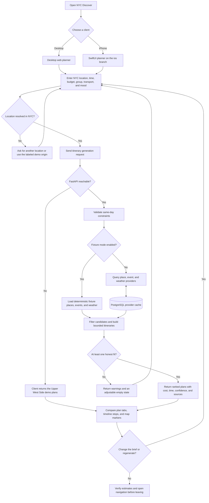

# NYC Discover

NYC Discover turns a free block of time into a small, practical same-day itinerary. The MVP combines nearby places, city events, weather, transparent estimates, and a bounded itinerary search rather than returning another long list.

## Stack

- `apps/web`: Next.js, React, Tailwind CSS, MapLibre
- `services/api`: FastAPI, Python
- PostgreSQL: provider-response cache only

Fixture mode is enabled by default, so the complete input-to-itinerary flow works without API keys or live network calls.

## Branch Layout

- `main` owns the desktop web app and shared FastAPI service.
- `ios` owns the native SwiftUI app used for iPhone simulator and device testing.
- `mobile` is the legacy branch name and should not receive new work.

The clients use the same planning model and API contract, while each branch can evolve and be tested without mixing platform build artifacts into the other.

## How It Works



## Quick Start

1. Copy the environment file:

   ```bash
   cp .env.example .env
   ```

2. Start PostgreSQL:

   ```bash
   docker compose up postgres -d
   ```

3. Start the API:

   ```bash
   cd services/api
   python3 -m venv .venv
   source .venv/bin/activate
   pip install -r requirements-dev.txt
   uvicorn app.main:app --reload --env-file ../../.env
   ```

4. Start the web app in a second terminal:

   ```bash
   npm ci
   set -a; source .env; set +a
   npm run dev
   ```

Open [http://localhost:3000](http://localhost:3000). The API docs are available at [http://localhost:8000/docs](http://localhost:8000/docs).

## Live Data

Set `FIXTURE_MODE=false` to enable live providers.

- Subscribe to the free Event Calendar product in the [NYC API Developers Portal](https://api-portal.nyc.gov/) and set `NYC_EVENT_CALENDAR_KEY`.
- Set a contactable `NYC_DISCOVER_USER_AGENT` before using Nominatim, Overpass, or the National Weather Service.
- Provider URLs are environment-configurable so the application can move away from public instances without a code release.

Live requests are rate-limited and cached. If a provider fails, the API uses a stale cache entry when possible and returns a warning instead of failing the entire itinerary request.

## Commands

```bash
# Backend tests that exercise the recommendation engine and provider cache
cd services/api && pytest

# Frontend unit tests
npm test

# Build and lint
npm run build
npm run lint

# Generate the TypeScript OpenAPI contract while the API is running
npm run types:generate
```

## Product Boundaries

The MVP is guest-only, NYC-only, and current-day-only. Budgets and cost totals are estimated per person. Travel legs are mode-aware estimates, not turn-by-turn routes. Missing price and duration details are always labeled as estimates and reduce confidence.
